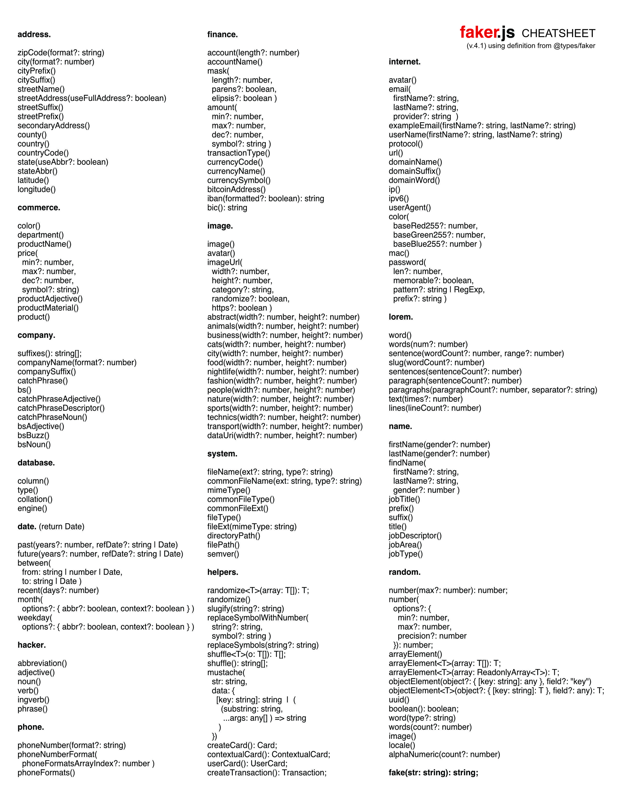

# Faker.js Cheatsheet

A one-page printable of faker.js API.

The original source is the `.afpub` file, you can open it in Affinity Publisher.

Inspried by [gojutin/tailwindcss-cheatsheet](https://github.com/gojutin/tailwindcss-cheatsheet), it is really useful!

